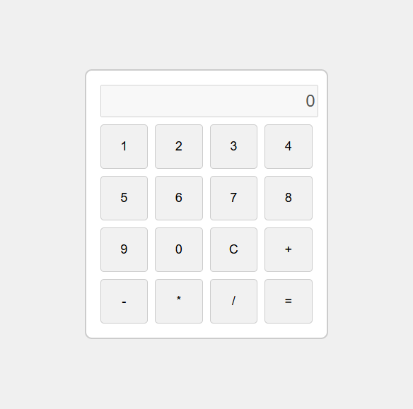

##Simple Calculator

This is a simple calculator implemented using HTML, CSS, JavaScript. The calculator allows users to perform basic  arithmetic operations such as addition, subtraction, multiplication, and division.

##Features

Perform basic arithmetic operations:
  ⦁	Addition (+)
  ⦁	Subtraction (-)
  ⦁	Multiplication (*)
  ⦁	Division (/)
  ⦁	Clear the input with the C button.

##Technologies Used

  ⦁	HTML :  For the structuring  the calculator interface.
  ⦁	CSS : For the styling and layout of the calculator interface.
  ⦁	JavaScript : For implementing the calculator logic and functionality.

##How to Use

 1.	Open the calculator.html file in a web browser.
 2.	Use the buttons provided to input numbers and perform operations.
 3.	Click the  '='  button to see the result.
 4.	Press the C button to clear the input and start a new calculation.

##Screenshot

